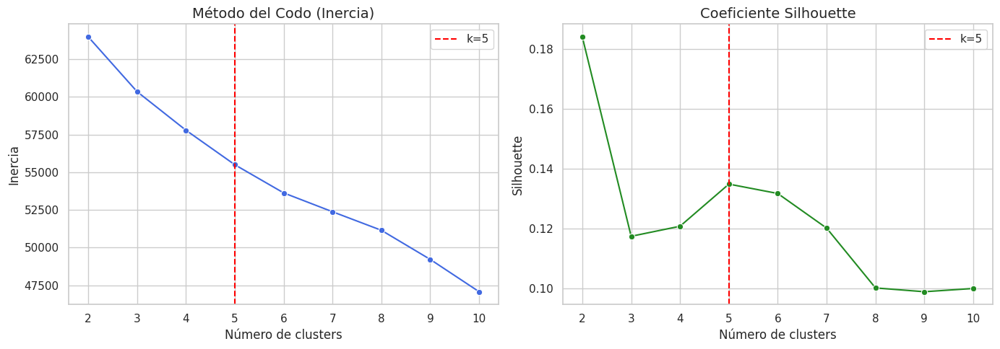
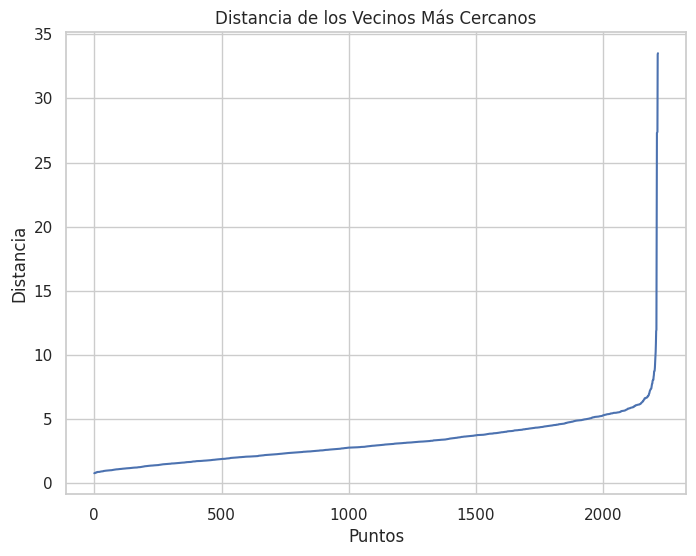
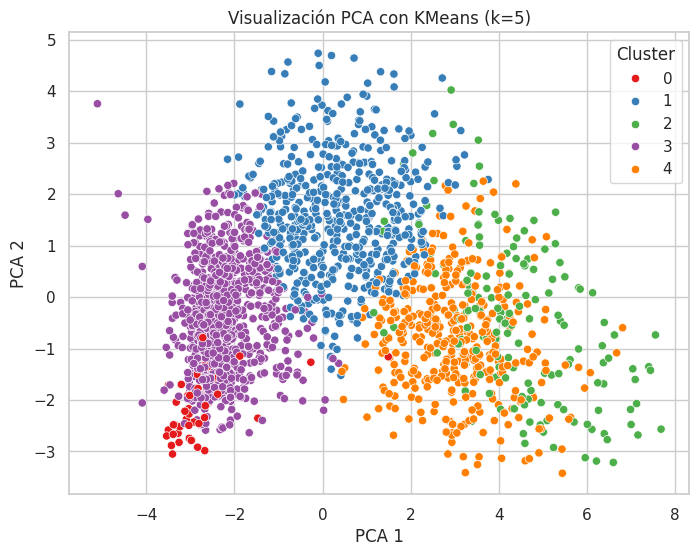
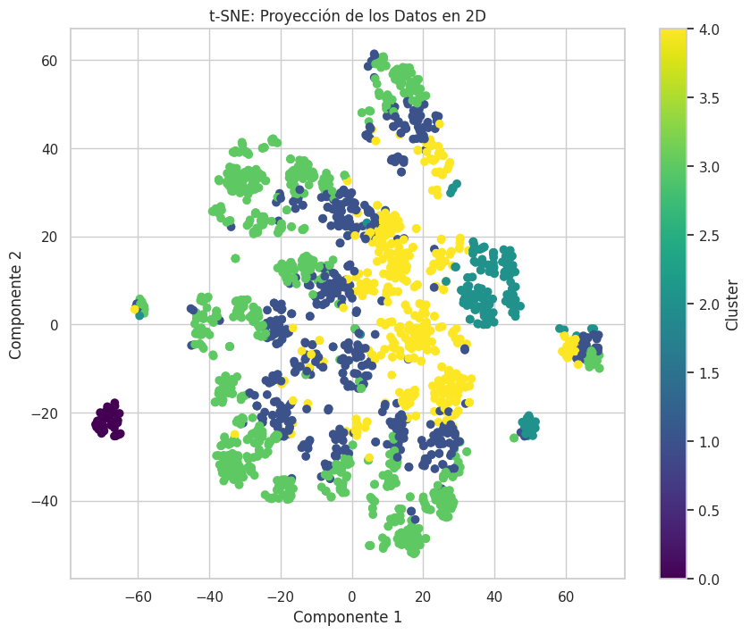
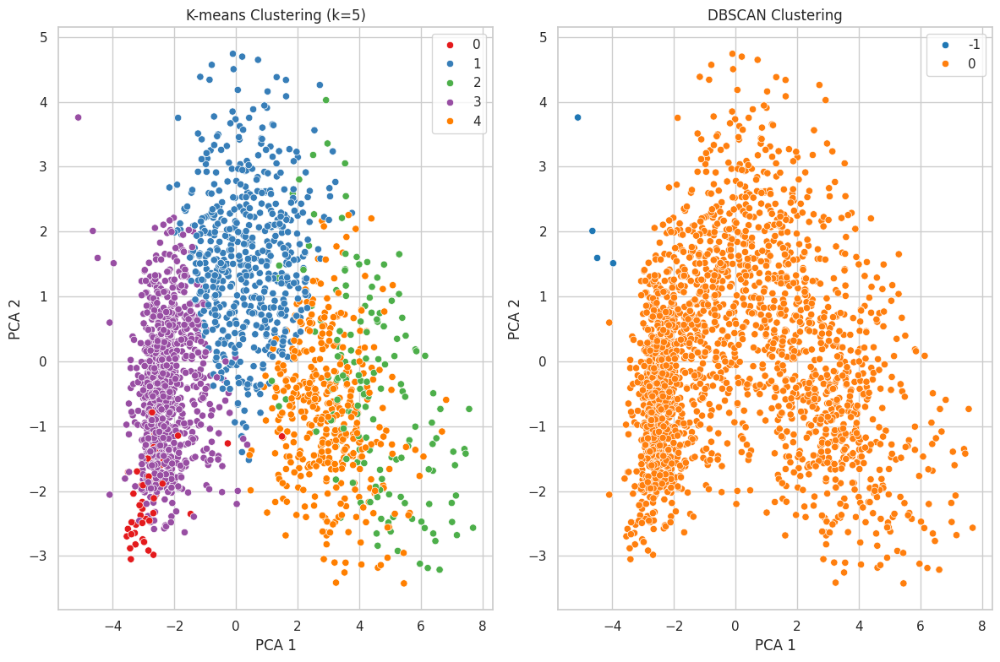

# Segmentación de Usuarios mediante Algoritmos No Supervisados

## 🔎 Índice

1. [Objetivos](#objetivos)
2. [Introducción](#introducción)
3. [Descripción del Conjunto de Datos](#descripción-del-conjunto-de-datos)
4. [Preprocesamiento de Datos](#preprocesamiento-de-datos)
5. [Aplicación de Algoritmos de Clustering](#aplicación-de-algoritmos-de-clustering)
6. [Visualización y Análisis de Resultados](#visualización-y-análisis-de-resultados)
7. [Resumen de Características por Clúster](#resumen-de-características-por-clúster)
8. [Comparación entre KMeans y DBSCAN](#comparación-entre-kmeans-y-dbscan)
9. [Análisis Técnico Detallado](#análisis-técnico-detallado)
10. [Conclusiones](#conclusiones)
11. [Recomendaciones](#recomendaciones)
12. [Anexos](#anexos)
13. [Autores](#autores)

---

## Objetivos

Implementar modelos de aprendizaje no supervisado para identificar segmentos de clientes a partir de sus características demográficas, de consumo y respuesta a campañas. Comparar modelos, validar visualmente los resultados y construir perfiles útiles para acciones de marketing personalizadas.

---

## Introducción

En este proyecto se aplican algoritmos no supervisados como KMeans y DBSCAN sobre un dataset de clientes, con el objetivo de segmentar perfiles de comportamiento y consumo. Se incluyen técnicas como PCA y t-SNE para reducir dimensionalidad y facilitar la visualización de resultados.

---

## Descripción del Conjunto de Datos

El dataset contiene 2,240 registros y 29 variables, agrupadas en:
- **Demografía:** Año de nacimiento, educación, estado civil, ingresos, hijos en el hogar.
- **Comportamiento de compra:** Gastos en distintas categorías (vino, carnes, dulces...).
- **Campañas de marketing:** Aceptación de campañas, respuesta general.
- **Canales de compra:** Compras en web, catálogo, tienda, visitas al sitio.

Este conjunto permite analizar tanto el perfil socioeconómico como el comportamiento transaccional y la respuesta a estímulos comerciales.

---

## Preprocesamiento de Datos

- Se eliminaron columnas no informativas (ID, fechas, costos fijos).
- Las variables categóricas fueron convertidas a dummies.
- Se estandarizó el conjunto con `StandardScaler`.
- Se imputaron valores nulos.
- Se agregó una columna de edad calculada y otras métricas agregadas.

Este preprocesamiento asegura que las variables estén en la misma escala y que los algoritmos de clustering funcionen correctamente.

---

## Aplicación de Algoritmos de Clustering

### KMeans
Se usó el método del codo para elegir el número óptimo de clústeres, identificado en **K=5**. Se aplicó el algoritmo y se interpretaron los clústeres generados mediante estadística descriptiva.

### DBSCAN
DBSCAN no requiere un número de clústeres predefinido. Se exploraron diferentes combinaciones de los parámetros `eps` y `min_samples` mediante la gráfica de distancia de vecinos más cercanos.

---

## Visualización y Análisis de Resultados

### Selección del Número Óptimo de Clusters
Para determinar el número óptimo de clusters se utilizaron dos métodos: el método del codo y el coeficiente de Silhouette. El método del codo evalúa la inercia (la suma de los errores cuadráticos dentro de los clusters) y mostró un punto de inflexión en K=5, lo que sugiere que añadir más clusters no mejora significativamente la segmentación. Por otro lado, el coeficiente de Silhouette mide qué tan bien está un punto dentro de su cluster en comparación con otros clusters. Aunque su valor máximo se presenta en K=2, el valor en K=5 también fue alto, lo cual valida esta elección desde otro enfoque.

### Método del Codo y Silhouette

Estas gráficas confirman que K=5 ofrece una segmentación equilibrada.

### Aplicación de Modelos de Clustering y Reducción de Dimensionalidad
Posteriormente, se procedió a la aplicación de los algoritmos de clustering K-Means y DBSCAN, y se utilizaron técnicas de reducción de dimensionalidad como PCA y t-SNE para visualizar los resultados. Se generaron proyecciones en dos dimensiones para ambos algoritmos, permitiendo evaluar la coherencia visual de los clusters.

### k-Distance Plot para DBSCAN

Ayuda a seleccionar el `eps` óptimo para DBSCAN. La "rodilla" indica la distancia crítica.

### Visualización con PCA y t-SNE

PCA permite ver una distribución lineal. t-SNE expone relaciones no lineales y muestra mejor separación entre los clústeres generados por KMeans.

### Comparativa KMeans vs DBSCAN

KMeans mostró límites definidos entre grupos. DBSCAN, con la parametrización actual, generó un único grupo con ruido disperso.

---

## Resumen de Características por Clúster

Se presentaron estadísticas como media e IQR por grupo. Algunas observaciones:
- Clúster 0: Ingresos altos, alto gasto en productos premium.
- Clúster 2: Menor interacción digital pero buena respuesta a campañas.
- DBSCAN agrupó la mayoría en un solo clúster, útil para detección de outliers.

Estas características permitieron desarrollar perfiles de clientes bien diferenciados.

---

## Comparación entre KMeans y DBSCAN

KMeans produjo clústeres más simétricos y balanceados. DBSCAN fue más útil para detección de ruido y patrones densos sin estructura clara. PCA y t-SNE validaron visualmente las agrupaciones de KMeans, especialmente en espacios no lineales.

---

## Análisis Técnico Detallado

- El método del codo detectó que a partir de K=5, la ganancia de información adicional disminuye.
- El coeficiente de Silhouette fue alto para K=5, validando la cohesión intra-clúster.
- DBSCAN fue sensible al valor de `eps`. El valor ideal se encontró cerca de 3.5.
- Visualmente, PCA y t-SNE confirmaron una estructura interna coherente en KMeans.
- Variables clave como `Income`, `MntWines`, `MntGoldProds`, `NumWebPurchases` y `AcceptedCmpX` fueron cruciales para definir los perfiles.

Limitaciones:
- DBSCAN requiere ajuste fino de parámetros. Un eps mal elegido puede agrupar todo en un clúster.
- El escalado estándar asigna igual peso a todas las variables, lo que puede no reflejar su importancia real.

---

## Conclusiones

- KMeans con **K=5** proporciona una segmentación robusta, interpretable y útil para estrategias comerciales.
- DBSCAN se recomienda como herramienta exploratoria para detección de valores atípicos.
- Las visualizaciones con t-SNE confirmaron que los grupos de KMeans son estructuralmente válidos.
- La segmentación permite diseñar campañas diferenciadas y mejorar la eficiencia de las acciones de marketing.

---

## Recomendaciones

- Utilizar los segmentos como insumo en sistemas CRM y campañas específicas.
- Ajustar DBSCAN dinámicamente o aplicar HDBSCAN para mayor granularidad.
- Incorporar análisis de importancia de variables o técnicas de reducción supervisada.
- Reentrenar el modelo con datos recientes de clientes activos.

---

## Anexos

- Dataset: `marketing_campaign.csv`
- Notebook: `Segmentacion_usuarios_unsupervised_v2.ipynb`
- Carpeta de Imágenes: `/Imagenes/`

---

## Autores

Francisco Estupiñan 
María Fernanda Bolaños
Fernando Montaño  
Proyecto de Segmentación de Usuarios - 2025
